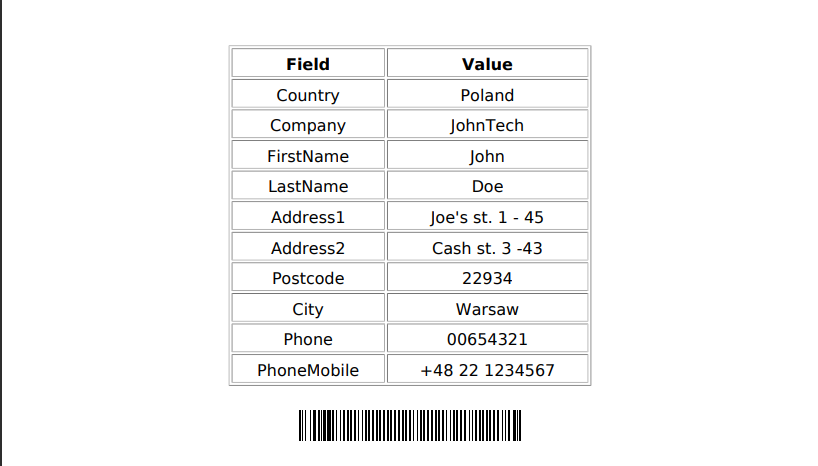

# ERP SIDE for Prestashop Carrier Module 🛒

ERP SIDE OF Carrier Module made for PrestaShop to easily print PDF Labels of a given Shipment. 🏷️

## Features
- 2 controllers
- Unit tests
- Save Customer's information to the Database
- Generate PDF Label of a given customer
- Easy Deployment with Docker
- Github CI/CD Pipelines

## Prerequisites
- Installed Prestashop Module: [Github link](https://github.com/SteponasK/Prestashop-Shipping)
- Docker
## Installation with Docker:

### Getting Started
1. Clone the project:
 `git clone https://github.com/SteponasK/PrestaShop-Shipping-ERP`
2. If not already done, [install Docker Compose](https://docs.docker.com/compose/install/) (v2.10+)
3. Run `docker compose build --no-cache` to build fresh images
4. Run `docker compose up --pull always -d --wait` to start the project
5. Open `https://localhost` in your favorite web browser and [accept the auto-generated TLS certificate](https://stackoverflow.com/a/15076602/1352334)
6. Run `docker compose down --remove-orphans` to stop the Docker containers.
7. Install [Shipping Module](https://github.com/SteponasK/Prestashop-Shipping).
8. Enjoy!

## Reminder!
- DONT FORGET TO CHANGE YOUR .ENV information (API_KEY, Database Name, Password)

## Docs 
1. [Build options](docs/build.md)
2. [Using Symfony Docker with an existing project](docs/existing-project.md)
3. [Support for extra services](docs/extra-services.md)
4. [Deploying in production](docs/production.md)
5. [Debugging with Xdebug](docs/xdebug.md)
6. [TLS Certificates](docs/tls.md)
7. [Using a Makefile](docs/makefile.md)
8. [Troubleshooting](docs/troubleshooting.md)
9. [Updating the template](docs/updating.md)

## Installation the other way:
1. Clone the project:
 `git clone https://github.com/SteponasK/PrestaShop-Shipping-ERP`
2. Run Composer Install:
`composer install`
3. Change your .env variables (db & api key)
4. Start Web Server
5. Install [Shipping Module](https://github.com/SteponasK/Prestashop-Shipping).
6. Enjoy!
## License

This project is available under the MIT License.

## Authors
- Steponas K
## Credits
Symfony Docker skeleton was created by [Kévin Dunglas](https://dunglas.dev), co-maintained by [Maxime Helias](https://twitter.com/maxhelias) and sponsored by [Les-Tilleuls.coop](https://les-tilleuls.coop).
